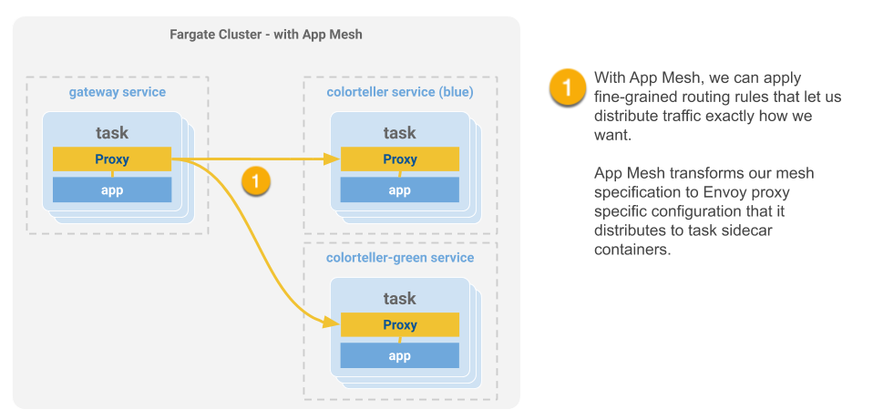

# Enable App Mesh for an ECS/Fargate Application using the AWS Console

> AWS just released new management console support for AWS App Mesh. Now customers can easily enable and gain the benefits of service mesh support for their microservice applications running on Amazon ECS and AWS Fargate.This article will demonstrate how to enable AWS App Mesh for a Fargate application for control over microservice routing.

## Introduction

In this article, we’re going to walk through a new Amazon ECS management console workflow for enabling AWS App Mesh support for containerized applications on ECS and Fargate. When you enable App Mesh for existing task definitions in the console using this new feature, Envoy proxy containers will be added and configured properly so that new tasks you deploy will be members of your application service mesh.  
  
What’s nice about this feature is that you can experiment with App Mesh in the console and when you’re finished, you can inspect or copy the configuration under the JSON tab in your task definition. You can use this information to set up scripts to automate your deployment of mesh-enable task definitions.  
  
We’ll use the [AWS Cloud Development Kit](https://aws.amazon.com/cdk/) \(CDK\) to make it easy to get started and launch a demo application. We’ll confirm the application works as expected. Then we’ll use the new console workflow for enabling App Mesh integration with the application. To verify that our application traffic is now managed by App Mesh, we’ll wire up a different version of a backend service and observe the results.  
  
The demo application we’ll use is called the **Color App**. A frontend service \(called **gateway**\) will use a backend service \(called **colorteller**\) to fetch a color. The first version of colorteller will be **blue** \(it always returns “blue”\) and the second version we’ll release as a canary will be **green** \(it always returns “green”\).

After we enable App Mesh integration for the app in the console using this new feature, Envoy proxy containers will automatically be configured and added to our task definitions; our updated services will now be members of a service mesh and we will be able to easily configure it in the console to send traffic to the canary, as shown here.

