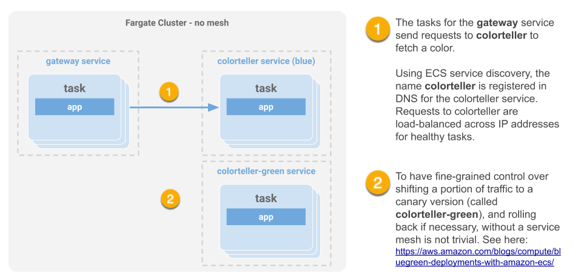
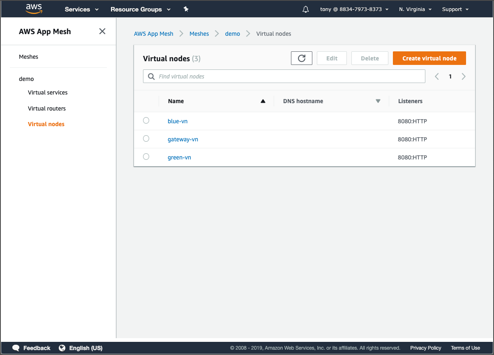
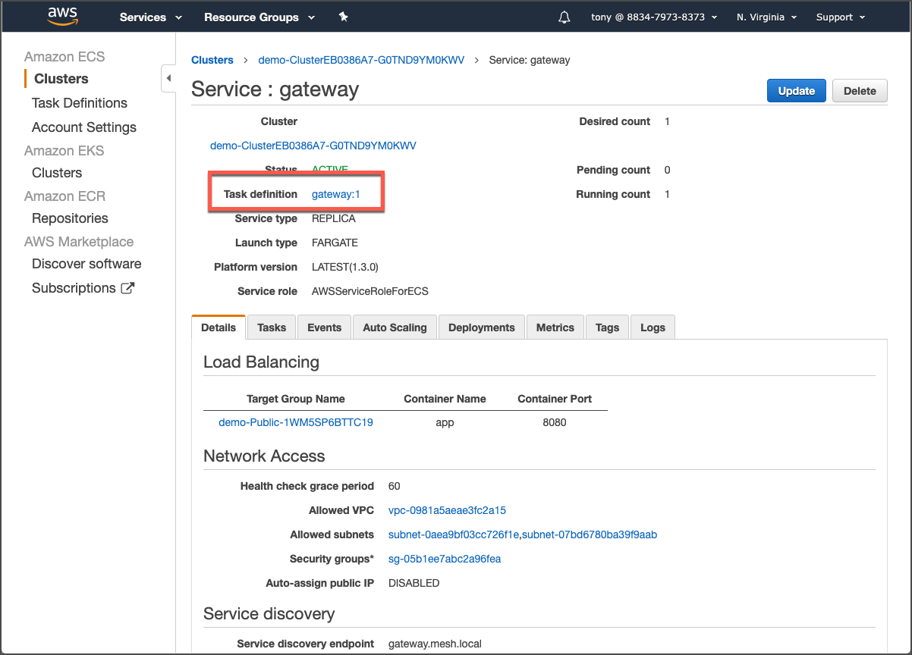
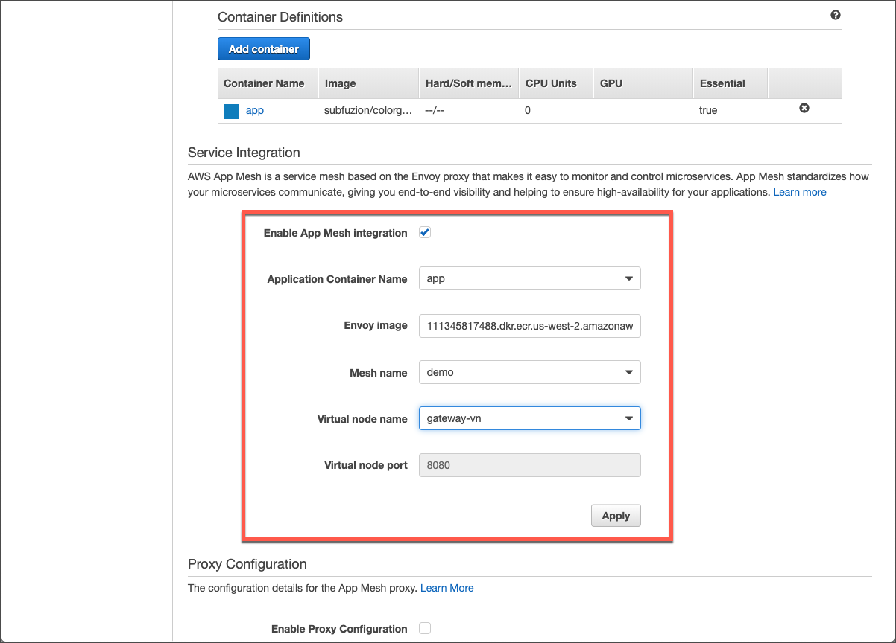
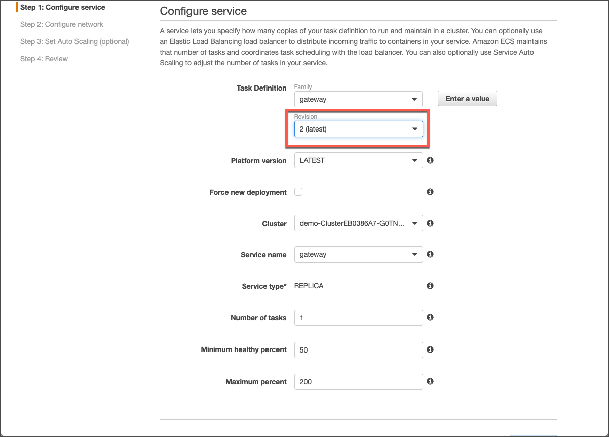
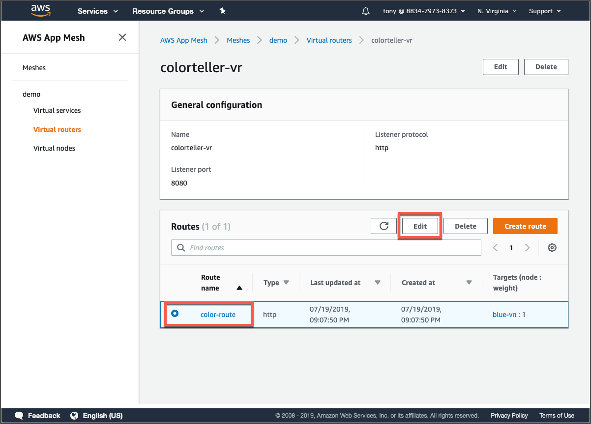

# Enable App Mesh for an ECS/Fargate Application using the AWS Console

> AWS just released new management console support for AWS App Mesh. Now customers can easily enable and gain the benefits of service mesh support for their microservice applications running on Amazon ECS and AWS Fargate.This article will demonstrate how to enable AWS App Mesh for a Fargate application for control over microservice routing.

## Introduction

In this article, we’re going to walk through a new Amazon ECS management console workflow for enabling AWS App Mesh support for containerized applications on ECS and Fargate. When you enable App Mesh for existing task definitions in the console using this new feature, Envoy proxy containers will be added and configured properly so that new tasks you deploy will be members of your application service mesh.  
  
What’s nice about this feature is that you can experiment with App Mesh in the console and when you’re finished, you can inspect or copy the configuration under the JSON tab in your task definition. You can use this information to set up scripts to automate your deployment of mesh-enable task definitions.  
  
We’ll use the [AWS Cloud Development Kit](https://aws.amazon.com/cdk/) \(CDK\) to make it easy to get started and launch a demo application. We’ll confirm the application works as expected. Then we’ll use the new console workflow for enabling App Mesh integration with the application. To verify that our application traffic is now managed by App Mesh, we’ll wire up a different version of a backend service and observe the results.  
  
The demo application we’ll use is called the **Color App**. A frontend service \(called **gateway**\) will use a backend service \(called **colorteller**\) to fetch a color. The first version of colorteller will be **blue** \(it always returns “blue”\) and the second version we’ll release as a canary will be **green** \(it always returns “green”\).



After we enable App Mesh integration for the app in the console using this new feature, Envoy proxy containers will automatically be configured and added to our task definitions; our updated services will now be members of a service mesh and we will be able to easily configure it in the console to send traffic to the canary, as shown here.


## Getting Started

We’re going to walk through using the AWS console to enable App Mesh for our demo. To make it easy to get started, we’ll first use the CDK to launch an application and get it running on Fargate. From that point on, we’ll do the rest of our work in the console.  
  
For getting started, [this CDK script](https://github.com/subfuzion/enable-appmesh/blob/master/cdk/lib/mesh-demo-stack.ts) is used to provision the resources needed for a typical, highly available application on AWS. The script takes care of the standard boilerplate so we can focus on the demo.  


* A VPC with two private subnets spread across two availability zones for our services.
* An internet gateway, two NAT gateways, and a public-facing load balancer for incoming web traffic.
* Task definitions for **gateway** and two different versions of **colorteller**.
* Fargate services are launched with tasks created from these task definitions. Their service names are registered in the **mesh.local** namespace.
* A basic App Mesh configuration. You need to have a service mesh before you can mesh-enable task definitions in the console.

#### Steps

1. Follow the steps for [Getting Started with the AWS CDK](https://docs.aws.amazon.com/cdk/latest/guide/getting_started.html).
2. Clone the [demo repo](https://github.com/subfuzion/enable-appmesh) from GitHub.
3. Ensure your environment is configured, as described [here](https://docs.aws.amazon.com/cdk/latest/guide/getting_started.html#getting_started_credentials).

Once your environment is configured for your AWS profile, you can launch the demo app. This example assumes you have a profile named democonfigured to use us-east-1.  


```text
$ cd cdk
cdk $ cdk deploy --user demo
```

You’ll see something like this:


After confirming you want to make changes, CDK will begin deploying the stack. The process will take around ten minutes. Once it’s finished, CDK will print the public URL for the deployment, which you can use to access the demo.  


```text
✅ demo

Outputs:
demo.URL = demo-Public-CT2TDYW6WK64-1122878379.us-east-1.elb.amazonaws.com
```

  
You can also view that stack and get the URL using the CloudFormation dashboard in the console.


The public endpoints for the app are:

* `/color`- fetch a color
* `/color/clear`- reset the color history

Using this example URL, you can test the color endpoint with curl:

```text
$ export demo=demo-Public-CT2TDYW6WK64-1122878379.us-east-1.elb.amazonaws.com
$ curl $demo/color
{"color":"blue", "stats": {"blue":1}}
```

  
The **gateway** service sends requests to fetch a color from **colorteller.mesh.local**. The app is taking advantage of ECS service discovery, which registers the IP address of each new task that starts up for a service into DNS. As tasks scale up and down, ECS ensures that gateway requests will get routed to a running colorteller task.  
  
Our CDK script also deployed an alternate version of the colorteller that always responds with green. However, it is not wired up into routing and we will only see blue results for now, no matter how many times we request a color. Once we enable App Mesh, we will distribute traffic between these two alternate versions.  


```text
$ for i in {1..10}; do curl $demo/color; done
{"color":"blue", "stats": {"blue":1}}
{"color":"blue", "stats": {"blue":1}}
{"color":"blue", "stats": {"blue":1}}
{"color":"blue", "stats": {"blue":1}}
{"color":"blue", "stats": {"blue":1}}
{"color":"blue", "stats": {"blue":1}}
{"color":"blue", "stats": {"blue":1}}
{"color":"blue", "stats": {"blue":1}}
{"color":"blue", "stats": {"blue":1}}
{"color":"blue", "stats": {"blue":1}}
```

## Console Walkthrough - Enable App Mesh

The Getting Started section got our demo app up and running on AWS Fargate. Now we will walk through the process of using the ECS console to update our task definitions to enable App Mesh for our app. This is the sequence of steps we’ll follow for this workflow:

1. Update our service mesh to take advantage of Cloud Map service discovery and prepare to take over routing for our tasks after we mesh-enable the task descriptions and restart tasks.
2. Create new revisions of our task definitions with App Mesh enabled.
3. Update our services to use the new mesh-enabled task definitions.
4. Confirm that the application continues to work as expected.
5. Update the mesh configuration to begin sending traffic to the green service and confirm this works.
6. Update the mesh configuration again to send all traffic now to the green service and confirm.

### Configure the Mesh

Go the App Mesh console and then navigate to **gateway-vn** under **Virtual nodes**. We’ll prepare the virtual node for our gateway tasks. It will be the same workflow for each of the other two virtual nodes as well.



Click the **Edit** button and on the **Edit virtual node** page, select **AWS Cloud Map** for the service discovery method. Set the values as shown here:


Save the changes and repeat the workflow for the other two virtual nodes \(**blue-vn** and **green-vn**\). Make sure to use the following values for the virtual nodes:  
  
**blue-vn**  
Service name: colorteller  
ECS\_TASK\_DEFINITION\_FAMILY: blue  
  
**green-vn**  
Service name: colorteller-green  
ECS\_TASK\_DEFINITION\_FAMILY: green

### Update Task Definitions

Go to the ECS console and navigate to the cluster that was just deployed.


We will enable App App mesh here for the gateway task definition. It will be the same workflow for the colorteller and colorteller-green task definitions.  
  
Click on the **gateway** service name to navigate to its service page. Then click on the **Task definition** link, shown below:



Click the **Create new revision** button.


In the **Create new revision of Task Definition** page, scroll down until you see the option to **Enable App Mesh Integration**. Check the option and additional fields will display, Update the dropdown fields to match the following:



What we are doing here is designating the primary app container for the task \(there is only one here\), the Envoy image to use for the service proxy \(we recommend using the one that is pre-filled\), the mesh that we want new tasks to be a part of, the virtual node that will be used to represent this task in the mesh, and the virtual node port to use to direct traffic to the app container \(there is only one here\).  
  
Click the **Apply** button. A dialog will pop up showing the changes that will be made to add Envoy. **Confirm** the changes, scroll to the bottom of the page, and finally click the **Create** button.  
  
Repeat this process for the other task definitions. You can find them as shown above for **gateway** by clicking on the **colorteller** and **colorteller-green** services, or you can go to them directly under the **Task Definitions** page.

### Update Services

Once our task definitions have been updated, we can update our services. Return to the **Clusters**page for the demo cluster. We’ll update the **gateway**service here. It will be the same workflow for the other two services as well.  
  
Check the **gateway** service, then click the **Update** button.


The only change here is to ensure you select the latest revision of the gateway Task Definition.



Scroll to the bottom of the page, click **Skip to review**, then click scroll to the bottom of the final page and click **Update Service.**  
  
Repeat this workflow for the other two services \(**colorteller** and **colorteller-green**\).  
  
Return to the **Cluster** page for the demo cluster, then click the **Tasks** tab.  
  
We can see that new tasks are starting for our updated services. As these tasks become healthy, the older tasks will gradually be stopped. This process can take several minutes as the Envoy image is pulled, and new tasks with both app and Envoy containers are started and become healthy.


It isn’t necessary to wait for the old tasks to drain; once the new tasks report that they’re RUNNING, we can test the app and confirm it still works.

```text
$ curl $demo/color/clear
cleared
$ for i in {1..10}; do curl $demo/color; done
{"color":"blue", "stats": {"blue":1}}
{"color":"blue", "stats": {"blue":1}}
...
```

### Update mesh routing to shift some traffic to green

Under the **Virtual routers**page in the App Mesh console, click **colorteller-vr** to go its page and then select **color-route**. Click the **Edit** button to update its rules.



On the page that displays next, click the **Edit** button so we can update the HTTP route rule that is configured here. Add a green virtual node target, and select a weight. For this example, we’ll choose a 4:1 ratio, simulating a canary release. You can use any integer ratio you prefer \(such as 80:20\) as long as the sum is not greater than 100. Click **Save** when finished.


App Mesh is highly optimized to distribute these updates through your mesh quickly. Go back to your terminal and run curl again with enough repetitions to confirm the canary works:  


```text
$ curl $demo/color/clear
cleared
$ for i in {1..200}; do curl $demo/color; done
{"color":"blue", "stats": {"blue":1}}
{"color":"green", "stats": {"blue":0.5,"green":0.5}}
...
{"color":"green", "stats": {"blue":0.79,"green":0.21}}
```

  
In our simplistic testing scenario we just want to confirm that we get green responses; we can observe with these results that the canary is performing admirably!  
  
Finally, update the route to send all traffic to the green virtual node. You can choose a 0:1 ratio or delete the blue virtual node altogether.

```text
$ curl $demo/color/clear
cleared
cdk$ for i in {1..200}; do curl $demo/color; done
{"color":"green", "stats": {"green":1}}
{"color":"green", "stats": {"green":1}}
...
{"color":"green", "stats": {"green":1}}
```

  
Will one hundred percent of traffic shifted to green tasks now, everything looks good, as we expected.

## Understanding the App Mesh Specification Model

We walked through the steps needed to configure App Mesh to shift traffic between the first version of our colorteller and the second. Let’s discuss how App Mesh uses and applies a mesh specification.  
  
The App Mesh specification for the demo that we configured in the console is based on an abstract model of our application communication requirements and policies. The logical resources that we configured reflect the full set of all available App Mesh resources available for representing services and managing application traffic.  


This is different model from either the programming model or the physical infrastructure model. It is this abstract model that allows App Mesh to compute the specific, relevant configuration it needs to distribute to each affected Envoy proxy running as a sidecar within each service’s task replica. Here’s how it works:  
  
\(1\) A virtual node represents the set of all healthy task replicas associated with a specific version of deployed code that has an Envoy proxy sidecar associated with. In this case, the gateway virtual node specification provides information about its communication requirements that App Mesh will ensure is applied to each running task replica of the gateway service in the mesh.  
  
The code for gateway sends requests to a backend associated with a service name \(in this case, the service name it is configured to use is a DNS hostname **colorteller.mesh.local.**The actual endpoint that the gateway service will use is **colorteller.mesh.local:8080**, because 8080 is the port that we chose for internal communication\). The virtual node configuration for **gateway** specifies that **colorteller.mesh.local** is a backend.  
  
This is important because App Mesh uses Envoy proxies to perform client-side routing. App Mesh listens to the service discovery provider \(AWS Cloud Map\) for changes in IP information related to a registered name. Each time a new backend task is created, ECS registers its IP address and App Mesh will be notified. App Mesh knows which virtual node is associated with these tasks. In fact, it can even filter specific tasks based on a Cloud Map service name attribute, as we saw in the walkthrough earlier. If it is a backend for any other virtual nodes, then App Mesh will send updated IP information to all affected task proxies in the mesh \(i.e., all tasks associated the virtual node specification that declared that the backenddependency.  
  
\(2\) For App Mesh to actually know what service name updates to listen for, there needs to be a virtual servicespec. This spec declares the service name and the provider that App Mesh to determine exactly what routing information it generate and send the consumer node \(gateway\).  
  
If the provider for the virtual service is another virtual node, then the IP configuration for communicating with all tasks associated with that virtual node \(for example, **colorteller**\) will get pushed out to all tasks associated with the consuming virtual node \(**gateway**\). By default, the Envoy proxy for each gateway task will apply round-robin load-balancing as it makes requests to backend tasks using the IP addresses it was given.  
  
\(3, 4, 5\) The alternative to using a virtual node as a provider is to use a virtual router, as in this case. A virtual router is an abstract resource used to apply routerules that distributetraffic among a set of \(one or more\) virtual nodes. In our demo, we apply a route rule based on an HTTP path, which in this case is simply the root path “/”; the action for our rule specifies using a weighted distribution of traffic between a set of virtual nodes.  
  
\(6, 7\) The target of the route rules that we applied to the virtual router scoped to a virtual service \(as its provider\). In this case we specified that we wanted traffic distributed among **colorteller**\(the original virtual node\) and **colorteller-green**\(our “updated” node for the canary release we tested\). These provide the spec for the mapping to the tasks that App Mesh is monitoring for updated IP information. As new colorteller tasks start or stop, ECS registers or unregisters their IP addresses from service discovery, and updates all consuming tasks as described in \(1\).

## Conclusion

In this article we demonstrated a convenient workflow for enabling App Mesh integration using the console for ECS tasks — this works whether you are using Fargate or EC2 launch types. Using the console, you can easily update task definitions to have an Envoy service mesh proxy container added and configured with defaults, requiring just a few inputs from you.  
  
This is useful for experimenting with App Mesh. Using the demo application, we were able to see how we can use the a traffic management feature of App Mesh to easily apply a routing rule to distribute traffic against two different service versions. After experimenting, you can take the generated task definition configuration and apply it to your own automated deployment process.  
  
App Mesh makes it simple to apply various release strategies, such as blue-green deployments, canary releases, and A/B tests. With a mesh in place, it is also easy to gain insights into application behavior and performance because service proxies are already instrumented for you.   
  
App Mesh has out of the box support for Amazon CloudWatch logs and metrics and AWS X-Ray for distributed tracing. There is also a healthy ecosystem of commercial and open source providers, including enterprise support for Envoy.  
  
Want to know more about App Mesh? Visit our [docs](https://docs.aws.amazon.com/app-mesh/), [examples repo](https://github.com/aws/aws-app-mesh-examples), and check out the [roadmap](https://github.com/aws/aws-app-mesh-roadmap). You can get the demo for this article [here](https://github.com/subfuzion/enable-appmesh).

